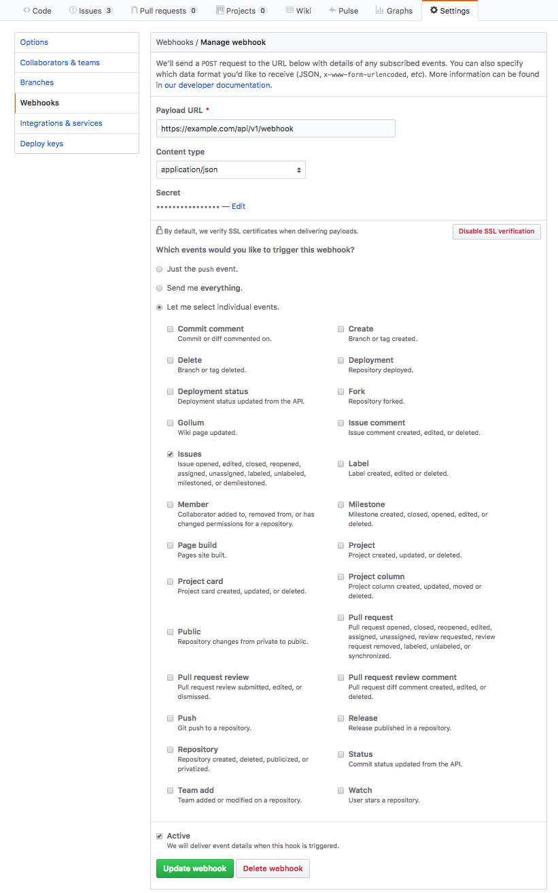
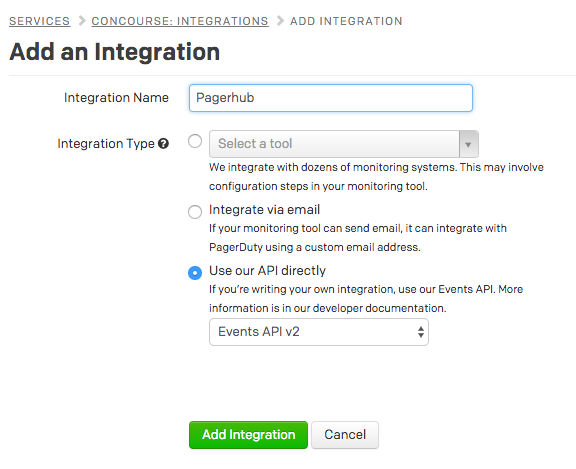
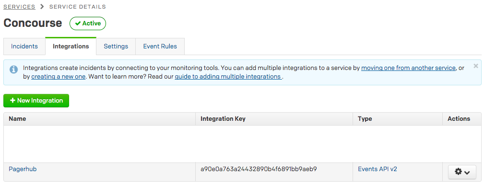

# pagerhub

Pagerhub is an application that listens for new Github issues opened and generates Pagerduty alerts.

## Deploying

### Github Integration

Pagerhub must be configured in your Github repository as a "Webhook". Here's an example of the production integration settings.

Make sure to configure `Payload URL` to the publicly available webhook URL (`/api/v1/webhook`) of your Cloud Foundry app (see below)

### Pagerduty Integration

Pagerhub must be configured in your Pagerduty service as a new integration that uses the "Events API v2". Here's an example of the production integration settings.

When added, you should see the integration key which will be used when running Pagerhub.

### Cloud Foundry

Pagerhub runs as an app on Cloud Foundry. To successfully push, you must provide the following:

- `GITHUB_WEBHOOK_SECRET`: *string*, Webhook secret provided by your Github integration, see "Secret" in the Github configuration above
- `PAGERDUTY_INTEGRATION_KEY`: *string*, Integration key provided by your Pagerduty integration, see "Integration Key" in the Pagerduty configuration above

Other configuration necessary to run on Cloud Foundry can be found in our [production manifest.yml](manifest.yml)

## Development

- Uses [gvt](github.com/FiloSottile/gvt) for vendoring
- Convenient `./scripts/build` script